<!-- Generated by scripts/generate-erd.mjs — do not edit by hand.
     Run `npm run docs:erd` after changing src/lib/db/schema.ts. -->

# Data model

47 tables in [schema.ts](../src/lib/db/schema.ts): **19** carry foreign keys and form the relational core below, **28** are standalone rows with no relations at all — mostly the per-page singleton `*Content` tables, listed at the end.

## Relational core

```mermaid
erDiagram
    User ||--o{ Session : "userId (cascade)"
    User ||--o{ Account : "userId (cascade)"
    Course |o--o{ Course : "parentKursId (set null)"
    WeeklyMenu ||--o{ DayMenu : "weeklyMenuId (cascade)"
    DayMenu ||--o{ DayMenuItem : "dayMenuId (cascade)"
    Dish |o--o{ DayMenuItem : "dishId"
    VenueInquiry ||--o{ VenueInquiryComment : "inquiryId (cascade)"
    User |o--o{ ErrorReport : "reportedBy"
    ErrorReport ||--o{ ErrorReportComment : "reportId (cascade)"
    Course ||--o{ CourseInstance : "courseId (cascade)"
    CourseInstance ||--o{ CourseApplication : "instanceId (cascade)"
    User |o--o{ Profile : "userId (set null)"
    Department |o--o{ NatureLifeCoursesContent : "departmentId (set null)"
    Course ||--o{ CourseDepartment : "courseId (cascade)"
    Department ||--o{ CourseDepartment : "departmentId (cascade)"
    Profile ||--o{ ProfileDepartment : "profileId (cascade)"
    Department ||--o{ ProfileDepartment : "departmentId (cascade)"

    User {
        text id PK
        text email UK
        int columns "9 total"
    }
    Session {
        text id PK
        text token UK
        text userId FK
        int columns "8 total"
    }
    Account {
        text id PK
        text userId FK
        int columns "13 total"
    }
    Course {
        text id PK
        text parentKursId FK
        text slug UK
        int columns "27 total"
    }
    Dish {
        text id PK
        int columns "11 total"
    }
    WeeklyMenu {
        text id PK
        int columns "8 total"
    }
    DayMenu {
        text id PK
        text weeklyMenuId FK
        int columns "4 total"
    }
    DayMenuItem {
        text id PK
        text dayMenuId FK
        text dishId FK
        int columns "4 total"
    }
    VenueInquiry {
        text id PK
        int columns "15 total"
    }
    VenueInquiryComment {
        text id PK
        text inquiryId FK
        int columns "4 total"
    }
    ErrorReport {
        text id PK
        text reportedBy FK
        int columns "19 total"
    }
    ErrorReportComment {
        text id PK
        text reportId FK
        int columns "4 total"
    }
    CourseInstance {
        text id PK
        text courseId FK
        text slug UK
        int columns "17 total"
    }
    CourseApplication {
        text id PK
        text instanceId FK
        int columns "19 total"
    }
    Profile {
        text id PK
        text userId FK
        int columns "12 total"
    }
    Department {
        text id PK
        text name UK
        int columns "6 total"
    }
    NatureLifeCoursesContent {
        text id PK
        text departmentId FK
        int columns "8 total"
    }
    CourseDepartment {
        text courseId PK
        text departmentId PK
        int columns "2 total"
    }
    ProfileDepartment {
        text profileId PK
        text departmentId PK
        int columns "4 total"
    }
```

### Columns

#### User

| Column | Type | Key | Null | References |
|---|---|---|---|---|
| `id` | text | PK |  |  |
| `name` | text |  |  |  |
| `email` | text | UK |  |  |
| `emailVerified` | integer |  |  |  |
| `image` | text |  | nullable |  |
| `createdAt` | integer |  |  |  |
| `updatedAt` | integer |  |  |  |
| `role` | text |  |  |  |
| `status` | text |  |  |  |

#### Session

| Column | Type | Key | Null | References |
|---|---|---|---|---|
| `id` | text | PK |  |  |
| `expiresAt` | integer |  |  |  |
| `token` | text | UK |  |  |
| `createdAt` | integer |  |  |  |
| `updatedAt` | integer |  |  |  |
| `ipAddress` | text |  | nullable |  |
| `userAgent` | text |  | nullable |  |
| `userId` | text | FK |  | User.id — on delete cascade |

#### Account

| Column | Type | Key | Null | References |
|---|---|---|---|---|
| `id` | text | PK |  |  |
| `accountId` | text |  |  |  |
| `providerId` | text |  |  |  |
| `userId` | text | FK |  | User.id — on delete cascade |
| `accessToken` | text |  | nullable |  |
| `refreshToken` | text |  | nullable |  |
| `idToken` | text |  | nullable |  |
| `accessTokenExpiresAt` | integer |  | nullable |  |
| `refreshTokenExpiresAt` | integer |  | nullable |  |
| `scope` | text |  | nullable |  |
| `password` | text |  | nullable |  |
| `createdAt` | integer |  |  |  |
| `updatedAt` | integer |  |  |  |

#### Course

| Column | Type | Key | Null | References |
|---|---|---|---|---|
| `id` | text | PK |  |  |
| `courseType` | text |  |  |  |
| `deliveryMode` | text |  | nullable |  |
| `parentKursId` | text | FK | nullable | Course.id — on delete set null |
| `slug` | text | UK |  |  |
| `title` | text |  |  |  |
| `excerpt` | text |  |  |  |
| `description` | text |  |  |  |
| `imageKey` | text |  | nullable |  |
| `isPublished` | integer |  |  |  |
| `isArchived` | integer |  |  |  |
| `duration` | text |  | nullable |  |
| `studyPace` | integer |  | nullable |  |
| `studyAidLevel` | text |  | nullable |  |
| `hasAccommodation` | integer |  |  |  |
| `accessibilityTags` | text |  |  |  |
| `locationText` | text |  | nullable |  |
| `tracks` | text |  |  |  |
| `infoSections` | text |  |  |  |
| `staff` | text |  |  |  |
| `links` | text |  |  |  |
| `gallery` | text |  |  |  |
| `blocks` | text |  |  |  |
| `headingColor` | text |  | nullable |  |
| `applicationSectionHeading` | text |  |  |  |
| `createdAt` | integer |  |  |  |
| `updatedAt` | integer |  |  |  |

#### Dish

| Column | Type | Key | Null | References |
|---|---|---|---|---|
| `id` | text | PK |  |  |
| `name` | text |  |  |  |
| `description` | text |  | nullable |  |
| `allergens` | text |  | nullable |  |
| `imageKey` | text |  | nullable |  |
| `price` | integer |  | nullable |  |
| `studentPrice` | integer |  | nullable |  |
| `vegetarian` | integer |  |  |  |
| `vegan` | integer |  |  |  |
| `createdAt` | integer |  |  |  |
| `updatedAt` | integer |  |  |  |

#### WeeklyMenu

| Column | Type | Key | Null | References |
|---|---|---|---|---|
| `id` | text | PK |  |  |
| `week` | integer |  |  |  |
| `year` | integer |  |  |  |
| `notes` | text |  | nullable |  |
| `footer` | text |  | nullable |  |
| `published` | integer |  |  |  |
| `createdAt` | integer |  |  |  |
| `updatedAt` | integer |  |  |  |

#### DayMenu

| Column | Type | Key | Null | References |
|---|---|---|---|---|
| `id` | text | PK |  |  |
| `weeklyMenuId` | text | FK |  | WeeklyMenu.id — on delete cascade |
| `day` | integer |  |  |  |
| `closed` | integer |  |  |  |

#### DayMenuItem

| Column | Type | Key | Null | References |
|---|---|---|---|---|
| `id` | text | PK |  |  |
| `dayMenuId` | text | FK |  | DayMenu.id — on delete cascade |
| `dishId` | text | FK | nullable | Dish.id |
| `sortOrder` | integer |  |  |  |

#### VenueInquiry

| Column | Type | Key | Null | References |
|---|---|---|---|---|
| `id` | text | PK |  |  |
| `name` | text |  |  |  |
| `organization` | text |  |  |  |
| `email` | text |  |  |  |
| `phone` | text |  |  |  |
| `eventType` | text |  |  |  |
| `requestedDate` | text |  |  |  |
| `alternativeDate` | text |  | nullable |  |
| `numberOfPeople` | integer |  |  |  |
| `venues` | text |  |  |  |
| `equipmentNeeded` | text |  | nullable |  |
| `meals` | text |  | nullable |  |
| `notes` | text |  | nullable |  |
| `status` | text |  |  |  |
| `createdAt` | integer |  |  |  |

#### VenueInquiryComment

| Column | Type | Key | Null | References |
|---|---|---|---|---|
| `id` | text | PK |  |  |
| `inquiryId` | text | FK |  | VenueInquiry.id — on delete cascade |
| `body` | text |  |  |  |
| `createdAt` | integer |  |  |  |

#### ErrorReport

| Column | Type | Key | Null | References |
|---|---|---|---|---|
| `id` | text | PK |  |  |
| `title` | text |  |  |  |
| `description` | text |  |  |  |
| `location` | text |  | nullable |  |
| `building` | text |  |  |  |
| `room` | text |  |  |  |
| `allowEntry` | integer |  |  |  |
| `category` | text |  |  |  |
| `priority` | text |  |  |  |
| `status` | text |  |  |  |
| `assignedTo` | text |  |  |  |
| `senderName` | text |  |  |  |
| `senderEmail` | text |  |  |  |
| `senderPhone` | text |  |  |  |
| `imageKey` | text |  | nullable |  |
| `reportedBy` | text | FK | nullable | User.id |
| `resolvedAt` | integer |  | nullable |  |
| `createdAt` | integer |  |  |  |
| `updatedAt` | integer |  |  |  |

#### ErrorReportComment

| Column | Type | Key | Null | References |
|---|---|---|---|---|
| `id` | text | PK |  |  |
| `reportId` | text | FK |  | ErrorReport.id — on delete cascade |
| `body` | text |  |  |  |
| `createdAt` | integer |  |  |  |

#### CourseInstance

| Column | Type | Key | Null | References |
|---|---|---|---|---|
| `id` | text | PK |  |  |
| `courseId` | text | FK |  | Course.id — on delete cascade |
| `slug` | text | UK |  |  |
| `year` | integer |  |  |  |
| `periodType` | text |  |  |  |
| `week` | integer |  | nullable |  |
| `schoolsoftId` | text |  | nullable |  |
| `extraFields` | text |  |  |  |
| `sortOrder` | integer |  |  |  |
| `startDate` | integer |  | nullable |  |
| `endDate` | integer |  | nullable |  |
| `spots` | integer |  | nullable |  |
| `applicationMethods` | text |  |  |  |
| `applicationText` | text |  | nullable |  |
| `applicationBlocks` | text |  |  |  |
| `createdAt` | integer |  |  |  |
| `updatedAt` | integer |  |  |  |

#### CourseApplication

| Column | Type | Key | Null | References |
|---|---|---|---|---|
| `id` | text | PK |  |  |
| `instanceId` | text | FK |  | CourseInstance.id — on delete cascade |
| `registrationCode` | text |  |  |  |
| `courseTitle` | text |  |  |  |
| `schoolsoftId` | text |  | nullable |  |
| `firstName` | text |  |  |  |
| `lastName` | text |  |  |  |
| `personalNumber` | text |  |  |  |
| `email` | text |  |  |  |
| `phone` | text |  |  |  |
| `address` | text |  | nullable |  |
| `postalCode` | text |  | nullable |  |
| `city` | text |  | nullable |  |
| `priorEducation` | text |  | nullable |  |
| `motivation` | text |  | nullable |  |
| `extraAnswers` | text |  |  |  |
| `attachments` | text |  |  |  |
| `status` | text |  |  |  |
| `createdAt` | integer |  |  |  |

#### Profile

| Column | Type | Key | Null | References |
|---|---|---|---|---|
| `id` | text | PK |  |  |
| `userId` | text | FK | nullable | User.id — on delete set null |
| `name` | text |  |  |  |
| `phone` | text |  | nullable |  |
| `directPhone` | text |  | nullable |  |
| `email` | text |  | nullable |  |
| `bio` | text |  | nullable |  |
| `imageKey` | text |  | nullable |  |
| `sortOrder` | integer |  |  |  |
| `published` | integer |  |  |  |
| `createdAt` | integer |  |  |  |
| `updatedAt` | integer |  |  |  |

#### Department

| Column | Type | Key | Null | References |
|---|---|---|---|---|
| `id` | text | PK |  |  |
| `name` | text | UK |  |  |
| `sortOrder` | integer |  |  |  |
| `isCourseDepartment` | integer |  |  |  |
| `href` | text |  | nullable |  |
| `imageKey` | text |  | nullable |  |

#### NatureLifeCoursesContent

| Column | Type | Key | Null | References |
|---|---|---|---|---|
| `id` | text | PK |  |  |
| `departmentId` | text | FK | nullable | Department.id — on delete set null |
| `heading` | text |  |  |  |
| `headingVisible` | integer |  |  |  |
| `headingColor` | text |  | nullable |  |
| `imageKey` | text |  | nullable |  |
| `blocks` | text |  |  |  |
| `updatedAt` | integer |  |  |  |

#### CourseDepartment

| Column | Type | Key | Null | References |
|---|---|---|---|---|
| `courseId` | text | PK |  | Course.id — on delete cascade |
| `departmentId` | text | PK |  | Department.id — on delete cascade |

#### ProfileDepartment

| Column | Type | Key | Null | References |
|---|---|---|---|---|
| `profileId` | text | PK |  | Profile.id — on delete cascade |
| `departmentId` | text | PK |  | Department.id — on delete cascade |
| `title` | text |  |  |  |
| `sortOrder` | integer |  |  |  |

## Soft references

Columns named like foreign keys but declared without a `references()` constraint, so they appear nowhere in the diagram above. Some are genuine in-database links the ERD cannot express (`sidebarProfileIds` holds a JSON array of `Profile` ids); others are identifiers owned by an external system and are not relations at all. Verify before treating any of them as a join.

| Table | Column | Type |
|---|---|---|
| Account | `accountId` | text |
| Account | `providerId` | text |
| ParticipantStory | `programId` | text |
| ParticipantStory | `summerCourseId` | text |
| CourseInstance | `schoolsoftId` | text |
| CourseApplication | `schoolsoftId` | text |
| CareersContent | `sidebarProfileIds` | text |
| StudentSupportContent | `sidebarProfileIds` | text |
| StudyGuidanceContent | `sidebarProfileIds` | text |

## Standalone tables

No foreign keys in either direction. The `*Content` tables are single-row page content holders — near-identical in shape, which is why they are listed rather than drawn.

| Table | Columns | Column names |
|---|---|---|
| Verification | 6 | `id`, `identifier`, `value`, `expiresAt`, `createdAt`, `updatedAt` |
| News | 13 | `id`, `title`, `slug`, `excerpt`, `content`, `imageKey`, `author`, `links`, `headingColor`, `isPublished`, `publishedAt`, `createdAt`, `updatedAt` |
| ParticipantStory | 11 | `id`, `name`, `graduationYear`, `courseName`, `story`, `imageKey`, `programId`, `summerCourseId`, `published`, `createdAt`, `updatedAt` |
| RestaurantContent | 5 | `id`, `intro`, `pricesNote`, `defaultMenuFooter`, `updatedAt` |
| Venue | 16 | `id`, `name`, `slug`, `description`, `category`, `capacity`, `priceInfo`, `availableTo`, `features`, `imageKey`, `blocks`, `headingColor`, `sortOrder`, `published`, `createdAt`, `updatedAt` |
| ContactContent | 15 | `id`, `addressStreet`, `addressCity`, `phone`, `email`, `invoiceEmail`, `invoiceNote`, `bankgiro`, `officeHours`, `absenceNotice`, `heading`, `headingVisible`, `headingColor`, `blocks`, `updatedAt` |
| HistoryContent | 8 | `id`, `sections`, `heading`, `headingVisible`, `headingColor`, `blocks`, `timeline`, `updatedAt` |
| CareersContent | 8 | `id`, `sections`, `heading`, `headingVisible`, `headingColor`, `blocks`, `sidebarProfileIds`, `updatedAt` |
| StudentRightsContent | 7 | `id`, `sections`, `heading`, `headingVisible`, `headingColor`, `blocks`, `updatedAt` |
| StudentSupportContent | 8 | `id`, `sections`, `heading`, `headingVisible`, `headingColor`, `blocks`, `sidebarProfileIds`, `updatedAt` |
| StudyGuidanceContent | 8 | `id`, `sections`, `heading`, `headingVisible`, `headingColor`, `blocks`, `sidebarProfileIds`, `updatedAt` |
| TermDatesContent | 7 | `id`, `sections`, `heading`, `headingVisible`, `headingColor`, `blocks`, `updatedAt` |
| AdmissionsContent | 7 | `id`, `sections`, `heading`, `headingVisible`, `headingColor`, `blocks`, `updatedAt` |
| SummerCoursesAdmissionsContent | 6 | `id`, `heading`, `headingVisible`, `headingColor`, `blocks`, `updatedAt` |
| BoardingContent | 6 | `id`, `heading`, `headingVisible`, `headingColor`, `blocks`, `updatedAt` |
| FolkEducationContent | 6 | `id`, `heading`, `headingVisible`, `headingColor`, `blocks`, `updatedAt` |
| AssociationContent | 11 | `id`, `sections`, `heading`, `headingVisible`, `headingColor`, `blocks`, `mapHeading`, `buildings`, `boardHeading`, `boardIntro`, `updatedAt` |
| HomeContent | 10 | `id`, `heading`, `headingVisible`, `headingColor`, `heroIngress`, `whyUsText`, `whyUsHeading`, `whyUsHeadingVisible`, `blocks`, `updatedAt` |
| SummerCoursesContent | 6 | `id`, `heading`, `headingVisible`, `headingColor`, `blocks`, `updatedAt` |
| SummerCoursesPracticalInfoContent | 6 | `id`, `heading`, `headingVisible`, `headingColor`, `blocks`, `updatedAt` |
| EveningCoursesContent | 6 | `id`, `heading`, `headingVisible`, `headingColor`, `blocks`, `updatedAt` |
| NewsHubContent | 6 | `id`, `heading`, `headingVisible`, `headingColor`, `blocks`, `updatedAt` |
| ParticipantStoriesContent | 6 | `id`, `heading`, `headingVisible`, `headingColor`, `blocks`, `updatedAt` |
| MaintenanceReportContent | 7 | `id`, `intro`, `heading`, `headingVisible`, `headingColor`, `blocks`, `updatedAt` |
| NavHubContent | 7 | `id`, `heading`, `headingVisible`, `headingColor`, `ingress`, `links`, `blocks` |
| VenuesContent | 5 | `id`, `heading`, `headingVisible`, `headingColor`, `blocks` |
| BgGradientSettings | 7 | `id`, `color1`, `color2`, `favorite1`, `favorite2`, `favorite3`, `updatedAt` |
| TypographySettings | 9 | `id`, `h1Font`, `h2Font`, `h3Font`, `bodyFont`, `locked`, `preset2`, `preset3`, `updatedAt` |
